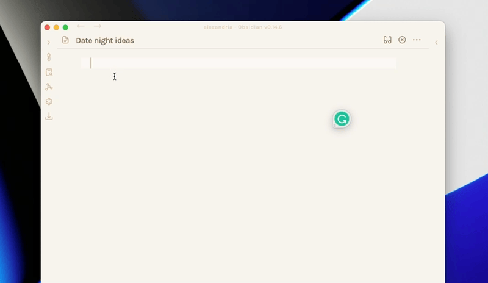
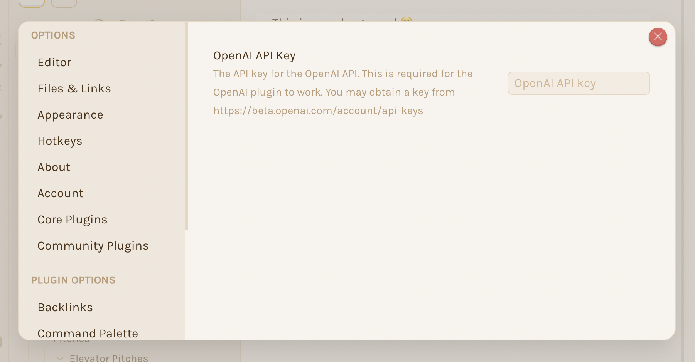

# Obsidian OpenAI Plugin

[OpenAI’s API](openai.com) provides access to GPT-3, which performs a wide variety of natural language tasks:
- Grammar Correction
- Summerizatoin
- Translation
- Classification
- etc.

These are all things that would give your second brain in [Obsidian](https://obsidian.md/) a HUGE BOOST 🚀.

To learn more about what Open AI is capable of see [OpenAI's Playground](https://beta.openai.com/examples).

## Demos

1. Helping me with date ideas:



## Installing the plugin

**Note:** The Plugin is still in early alpha and is not available as an offical plugin yet.

1. Navigate to your vault:

```
cd `VaultFolder/.obsidian/plugins/`
```

2. Clone the plugin:

```
git clone git@github.com:anaptfox/obsidian-openai.git
```

3. Enable and Configure the Plugin:



## Issues or Feature Rquests

If you have any feedback or find any bugs, please open an [issue](https://github.com/anaptfox/obsidian-openai/issues).

## Support Ya Boi

If you like the plugin and would like to support ya boi, you can [buy me a coffee](https://www.buymeacoffee.com/anaptfox).

## Futher Resources

- [Obsidian API](https://github.com/obsidianmd/obsidian-api)
- [Unofficial Obsidian Plugin Developer Docs](https://marcus.se.net/obsidian-plugin-docs/)
